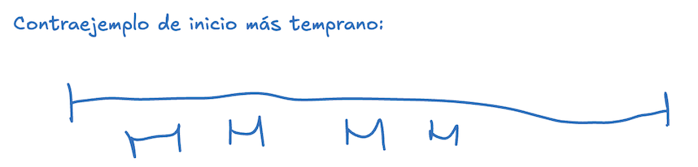
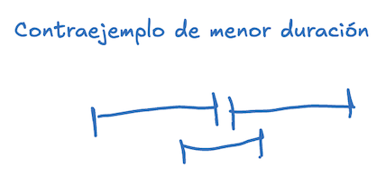
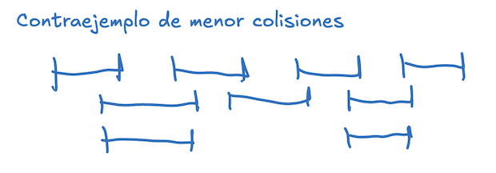

# Problema de Interval Scheduling

Tengo un aula/sala donde quiero dar charlas. Las charlas tienen horario de inicio y fin. Quiero utilizar el aula para dar la mayor cantidad de charlas. 
¿Qué podemos hacer? 

Para cada una de las estrategias, las enunciamos, analizamos si es óptima, pero además vamos a analizar sí/por qué el algoritmo es greedy. 

## Estrategia 1: Ordenamos por el que comienza antes

Nuestro algoritmo podría ser: 
1. Comienzo con mis charlas agregadas vacías. 
1. Ordeno por tiempo de inicio.
1. Por cada charla en ese orden, si la charla no colisiona con ninguna anteriormente agregada, entonces la agregamos. 

### ¿El algoritmo es óptimo?

En sí es fácil encontrarle un contraejemplo:

{width="400"}

El óptimo sería con 4, pero simplemente devolvemos 1. 

### ¿El algoritmo es greedy?

La realidad es que es un tanto borde, y la respuesta objetivamente es: no. Este algoritmo no es greedy. ¿Por qué? ¿Acaso la regla greedy no es clara y sencilla? Sí, la regla greedy es clara (busco la charla que empiece más temprano, dentro de las que quedan por analizar, y vemos si la podemos considerar). 

La pregunta importante es: ¿cuál sería el óptimo local aquí? Empezando antes, ¿qué estamos optimizando respecto a dar mayor cantidad de charlas? Sí lográs encontrar respuesta a esto, felicitaciones... la realidad es que, al menos yo, no puedo encontrar esta respuesta. Y si no podemos responderla, es que no hay un óptimo local que se vincule con el global. Y si no hay esto, el algoritmo **no** es greedy. 

## Estrategia II: Ordenamos por menor duración

El algoritmo es idéntico al anterior, pero ordenando por criterio diferente. 

Acá, nuevamente, podemos encontrar fácil un contrajemeplo: 

{width="250"}

El óptimo son 2 charlas, y vamos a devolver 1. 

### ¿El algoritmo es greedy?

En este caso, la respuesta parece clara en que sí lo es. Aplicamos la regla greedy en cada iteración de quedarnos con la tarea más pequeña de las que nos queden. 

¿Cuál es el óptimo local? Usar la menor cantidad del espacio posible, para dejar la mayor cantidad para el resto. 

Su falla está en que no hay una relación entre cómo una charla puede colisionar con otras 2 en tiempo absoluto. 

## Estrategia III: ordenamos por menor cantidad de colisiones

Similar a los anteriores, pero calculamos las colisiones con las demás charlas y ordenamos por ese criterio. 

Nuevamente, el algoritmo no es óptimo, pero esta vez encontrar el contraejemplo demanda un poco más porque tenemos que empezar a generar colisiones diferentes: 

{width="300"}

El óptimo es 4, pero vamos a terminar dando 3 charlas. 

### ¿El algoritmo es greedy?

Este es un poco más difícil, porque la intuición de cualquier persona leyendo es que claramente es greedy. Lamento decirles: no lo es. Vamos a la definición de algoritmo greedy: "Busca aplicar una regla greedy que nos lleve a una secuencia de óptimos **locales**, y estos nos lleven a un óptimo global". Importante: **Locales**. Es decir, del estado actual. 

Este algoritmo no tiene una regla greedy: no usa el estado local. 

> _¿Cómo que no?_

No. Fíjense: calculamos las colisiones. Bien. Elijo la que menos colisiones genera. Ok, esa seguro entra (no va a tener conflictos). Ahora vamos a otra charla... elegimos la segunda con menos colisiones, ¿verdad? Eso no es Greedy. 

> _¿Cómo dice que dice?_

Eso no es Greedy. 

> _Me estás tomando el pelo, ¿verdad?_

Hacele zoom a esa lógica: elegiste la segunda con menos colisiones **respecto al estado inicial**. No al actual. Ahora mismo, ¿por qué importaría las charlas previamente analizadas? Parece que no importa mucho esto, pero sí importa. Justamente, eso hace que no sea greedy. Mantener que analizamos colisiones con una charla agregada no va a cambiar en nada porque las que colisionan con esta igual serían descartadas, así que no van a cambiar el resultado. Pero suponé que la segunda charla con menos colisiones colisiona con la primera (es decir, la descartamos), ¿por qué importarían sus colisiones para analizar la situación en futuras iteraciones? 

Es decir, el algoritmo no es greedy, porque no analiza el estado actual. 

> _Pero en los casos anteriores..._

En los casos anteriores no teníamos ese problema: una charla empieza cuando empieza. Una charla dura lo que dura. Eso no está dado por una relación con las demás. Allí la diferencia. 

> _¿Cómo se arregla este problema?_

Recalculando las colisiones en cada paso. Es decir, en cada iteración calculamos las colisiones entre las charlas que queden (podemos optimizar este paso ya filtrando las que colisionan con una que hayamos acabado de agregar). 

> _¿Ahora sí sería greedy?_

Si, porque ahora el óptimo si sería local. 

> _¿Ahora el algoritmo es óptimo?_

No, lamentablemente no. El contraejemplo anterior sigue sirviendo de contraejemplo en este caso, porque es la tarea con menos colisiones la que nos complica (la del medio). Vamos a seguir devolviendo 3. 


## Estrategia IV: ordenamos por menor tiempo de fin

Similar a anteriores: 

Nuestro algoritmo podría ser: 
1. Comienzo con mis charlas agregadas vacías. 
1. Ordeno por tiempo de fin.
1. Por cada charla en ese orden, si la charla no colisiona con ninguna anteriormente agregada, entonces la agregamos.

### ¿El algoritmo es óptimo?

Si, lo es. Finalmente! 

Nuestra lógica que charlamos en clase: al agarrar la charla que antes termina, me aseguro de volver a tener una misma instancia del problema (sin posibles huecos) que ahora comienza en el fin de esa charla. 

Si les interesa que agreguemos una demostración formal a esta sección.

### ¿El algoritmo es Greedy? 

Sí, lo es. En este caso, justamente por lo mencionado antes: estamos dejando tanto tiempo restante como podamos para aumentar la cantidad de charlas que vayan a entrar. Ese es el óptimo local, que obtenemos con nuestra regla (de los que quedan, el que termine antes). Se relaciona con el de menor duración, pero el de menor duración deja fragmentación en el intervalo que genera problemas. Esta solución no tiene fragmentación alguna: nada anterior a este fin puede utilizarse, punto. 

### Algoritmo

```python
def scheduling(horarios):
	horarios_ordenados = ordenar_por_horario_fin(horarios)
	charlas = []
	for horario in horarios_ordenados:
		if len(charlas) == 0 or not hay_interseccion(charlas[-1], horario):
			charlas.append(horario)
	return charlas

def hay_intersection(anterior, nueva):
    return anterior[FIN] > nueva[INICIO]
```

Dado que solo necesitamos validar contra la última agregada si hay colisión (si no hay con esta, es imposible que haya con una anterior), entonces eso simplifica notoriamente. Al final del día, vamos a tener una complejidad de $\mathcal{O}(n \log n)$, por el ordenamiento (eventualmente, si se pudiera ordenar usando un ordenamiento no comparativo, podríamos incluso mejorar esto). Mientras, todas las alternativas anteriores eran cuadráticas, o incluso peores. 

