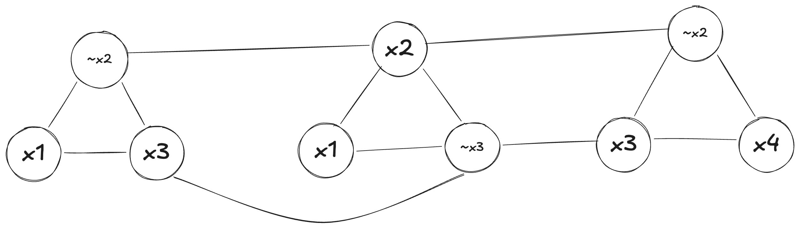

# Independent Set es NP-Completo, usando 3-SAT

En la primera clase hacemos esta reducción aún sin haber hablado de problemas NP-Completos. Aquí haremos la misma reducción, pero incluyendo el validador para hacerlo completo como en el contexto de un examen.

## Validador

```python
def validadorIS(grafo, k, indset):
	indset = set(indset) # si asumimos que ya es un set, ok, lo hago por si acaso
	if len(indset) < k:
		return False

	for v in indset:
		if v not in grafo:
			return False

	for v in indset:
		for w in indset:
			if v == w:
				continue
			if grafo.hay_arista(v, w):
				return False
	return True
```

Este validador funciona en tiempo $\mathcal{O}\left(k^2\right)$, (con $k$ nunca mayor a $n$), por lo que es en efecto polinomial. Independent Set es un problema en NP. 

## Reducción propuesta

* Creamos un nuevo grafo `G`. 
* En dicho Grafo, creamos $3k$ nodos (siendo $k$ la cantidad de cláusulas). 
* Creamos un triángulo por cada cláusula (es decir, unimos los nodos que representan a cada término de la cláusula). 
* Ponemos arista entre un término que represente a una variable, y un término que represente al complemento de la misma (pueden haber varias repeticiones nodos por una misma variable y/o complemento, agregar por cada par). 

Ejemplo: Si tengo que mis cláusulas son, por ejemplo $(x_1 \lor ~x_2 \lor x_3) \land (x_1 \lor x_2 \lor ~x_3) \land (x_4 \lor x_3 \lor ~x_2)$ el grafo resultante sería: 


{:width="50%"}

**Decimos entonces que**:

La instancia de 3-SAT (de $k$ cláusulas) es satisfacible $\iff$ El grafo G resultante tiene un independent set de al menos $k$ vértices. 

Como primera nota: es imposible que haya un Independent Set de más de $k$ vértices en este grafo. Tenemos $k$ triángulos. En cada triángulo no puedo tener más de un vértice en el _IS_ porque sino serían adyacentes (no sería un _IS_). Entonces podemos tener, como mucho, un vértice de cada triángulo, por lo que es imposible tener uno de más de $k$ vértices. 

### Demostramos que si 3-SAT es satisfacible $\rightarrow$ Hay _IS_ en el grafo creado

Esta demostración es relativamente sencilla por método directo. Si hay un 3-SAT, significa que hay _al menos_ una término activo en cada cláusula (podría haber más de uno, y he aquí que es importante que creamos un nodo por término y no por variable). Elegimos alguno de esos términos activos (sea variable o complemento) como parte del _IS_. 

Primer punto: este _IS_ tiene exactamente $k$ vértices (elegimos un vértice por cláusula=triángulo, que son $k$). 

Segundo punto: en efecto este es un _IS_. Como elegimos un sólo vértice por cada triángulo, no hay conflictos dentro del triángulo (nuevamente, aquí es importante haber repetido). Lo que queda es ver intra-triángulo, que tenemos arista entre variables con su complemento (cada par variable-complemento como haya). Pero es imposible que ambos pertenezcan al _IS_ porque significaría que tanto una variable como su complemento estaban activos en el 3-SAT que era, por hipótesis de método directo, satisfacible (entonces no existe variable y complemento ambos activos). 

Por lo tanto, si 3-SAT es satisfacible hay un _IS_ de tamaño al menos (y exacto) $k$ en el grafo generado. 


### Demostramos que si hay _IS_ en un grafo resultante de una creación $\rightarrow$ hay 3-SAT

Nuevamente, vamos por método directo. Suponemos que tenemos un _IS_ en el grafo generado (no un grafo cualquiera, uno con las características generadas a partir de una instancia de 3-SAT). Ese _IS_ tiene que tener exactamente $k$ vértices por lo explicado antes. Y tiene que tener si o si uno por triángulo (es decir, uno por cada representación de cada cláusula). Si esto no fuera cierto (un triángulo no tiene ninguno), sería porque hay 2 (o 3) en triángulo y eso no sería un _IS_ válido. 

Agarramos ese vértice parte del _IS_ en un triángulo, e indicamos que esa variable/complemento está activada. Es imposible que en este proceso digamos que una variable y su complemento están activados, porque es imposible que una variable y su complemento estén en el _IS_ en simultáneo (son adyacentes). Hacemos eso por cada cláusula, y tenemos un elemento activo por cada cláusula, logrando satisfacer el 3-SAT. 

Importante a notar: 
1. Podríamos en dos cláusulas diferentes haber elegido vértices que representan a la misma variable (complemento). Esto no es un problema. 
2. Podría una variable ni su complemento haber sido elegido para estar activo. Tampoco es un problema, significa que es irrelevante su valor dado el resto, lo cual significa que podemos elegir tanto que la variable esté activa como su complemento (elijamos una, pues, y listo).  

Con esto hemos demostrado que, si tenemos un grafo como el generado a partir de una instancia de 3-SAT, y este tiene un Independent Set de al menos (y exactamente) $k$ vértices, entonces dicha instancia de 3-SAT es satisfacible. 

### Conclusión

Habiendo demostrado que a reducción propuesta es correcta (y polinomial), reduciendo un problema NP-Completo (3-SAT), y demostrando que Independent Set está en NP, podemos concluir que Independent Set es un problema NP-Completo. 
