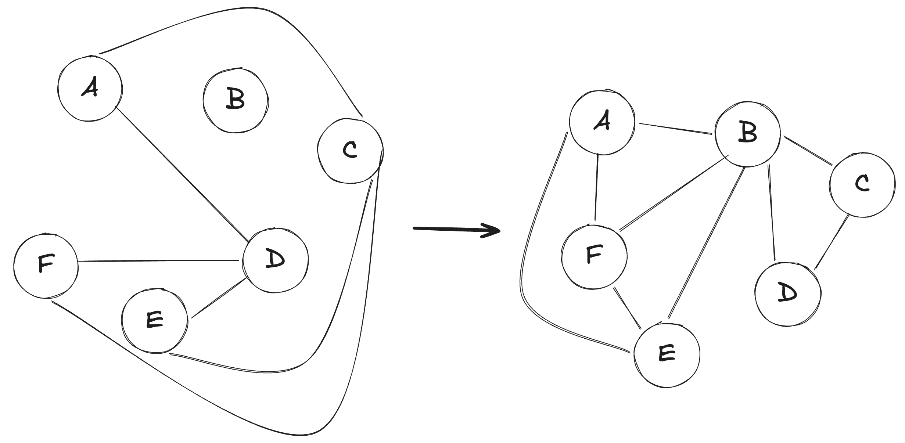

# K-Clique es NP Completo (usando Independent Set)

El problema de K-clique indica: Dado un grafo (puede aplicar a dirigido o no dirigido, aunque suele plantearse para no dirigidos) y un valor $K$, ¿Existe en el grafo un clique de al menos $K$ vértices? Recordando que un clique es un subgrafo completo dentro del grafo. Es decir, si hay un subgrafo, completo, de al menos $K$ vértices. 

## Validador

```python
def hay_k_clique(grafo, k, solucion):
	solucion = set(solucion) # si ya lo asumimos un set, podemos obviar, pero aclarar
	if len(solucion) < k:
		return False
	for v in solucion:
		if v not in grafo:
			return False
	for v in solucion:
		for w in solucion:
			if v == w:
				continue
			if not grafo.hay_arista(v, w):
				return False
	return True
```

Vemos que esta solución es $\mathcal{O}\left(k^2\right)$, por lo tanto es un validador polinomial. Entonces, el problema está en NP. 

## Reducción propuesta

Utilizamos como auxiliar a IndependentSet (IS), que ya sabemos que es NP-Completo. 

Construimos un grafo G' que sea el complemento del grafo original. Es decir, que es un grafo con los mismos vértices, pero tiene arista $(v, w)$ tal que dicha arista no existe en el grafo original. 

Como ejemplo: 

{width="350"}


**Decimos entonces que**:

El grafo original tiene un independent set de al menos $K$ vértices $\iff$ El grafo G' resultante tiene un Clique de al menos $K$ vértices. 

### Hay _IS_ en el grafo original de al menos K vértices $\rightarrow$ El grafo creado tiene un clique de al menos K vértices

Nuevamente vamos por método directo. Supongamos que en efecto tenemos un _IS_ de al menos $K$ vértices en el grafo original. Eso, por definición, significa que ninguno de los vértices es adyacente a ninguno de los demás de ese IS (que son $K$ o más). Es decir, que no existen aristas entre sí. Entonces, en el complemento existen dichas aristas (porque justamente tiene las que no tiene el original). Todos esos vértices deben conectarse entre sí en el complemento. Al conectarse todos entre sí, el subgrafo que contiene a dichos vértices (que son al menos $K$) debe ser completo, y por lo tanto un clique, de al menos $K$ vértices.


### El grafo creado tiene un clique de al menos K vértices $\rightarrow$ Hay _IS_ en el grafo original de al menos K vértices

Demostramos nuevamente por método directo. La demostración es bastante semejante porque se trata de una reducción por equivalencia directa (como en el caso de Vertex Cover con IS). 

Suponemos que en efecto en nuestro grafo complemento tenemos un clique de al menos $K$ vértices (pueden ser $K$, o más). Eso significa que, por definición, esos vértices son necesariamente adyacentes todos contra todos. Entonces, si vamos al grafo original, esas mismas aristas dejan de existir (porque están en el complemento por no haber existido en el original). Todos esos vértices pasan a no ser adyacentes ninguno con ninguno. Es decir, esos vértices (que son al menos $K$) conforman un Independent Set en el grafo original, porque en dicho grafo ninguno es adyacente a ninguno. Si alguno fuera adyacente a algún otro, significa que no eran un clique en el complemento. Entonces, en el grafo original tenemos, en efecto, un IS de al menos $K$ vértices. 

## Conclusión

Habiendo demostrado que a reducción propuesta es correcta (y polinomial), reduciendo un problema NP-Completo (_IS_), y demostrando que K-Clique está en NP, podemos concluir que K-Clique es un problema NP-Completo. 

