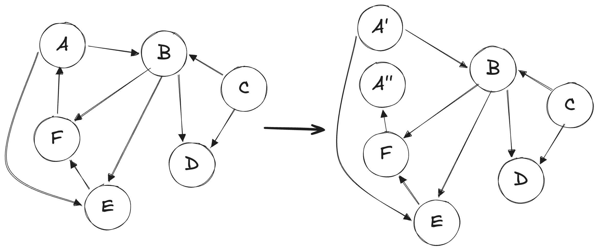

# Camino Hamiltoniano (dirigido)

Demostramos que el problema de Camino Hamiltoniano en un Grafo **DIRIGIDO** es un problema NP-Completo. Es importante notar que la reducción que vamos a plantear tiene sentido únicamente para grafos dirigidos, por lo que para grafos no dirigidos es necesario plantear otra reducción, que se hará en un siguiente documento. 


## Validador

```python
def es_camino_hamiltoniano(grafo, camino):
	if len(camino) != len(grafo):
		return False
	if len(grafo) == 0:
		return True
	visitados = set() # para evitar repeticiones

	anterior = camino[0]
	if anterior not in grafo:
		return False
	visitados.add(anterior)

	for actual in camino[1:]:
		if actual not in grafo or not grafo.hay_arista(anterior, actual):
			return False
		if actual in visitados: # ya fue visitado
			return False
		visitados.add(actual)
		anterior = actual

	return len(visitados) == len(grafo) # en si no es necesario, podría ser return True
```

Esto simplemente implica seguir el camino propuesto de aristas, pasando por los vértices una única vez, así que se trata de un algoritmo $\mathcal{O}(V)$, por lo tanto polinomial. El Problema de Camino Hamiltoniano está en NP. 


## Reducción propuesta

Vamos a reducir el problema de Ciclo Hamiltoniano (sobre un grafo dirigido), ya conocido como NP-Completo, al problema de Camino Hamiltoniano (también, sobre grafo dirigido). 

La reducción propuesta es: Creamos un nuevo grafo con mismos vértices y aristas, elegimos cualquier vértice $v$ al azar. Ese vértice lo reemplazamos por 2 vértice $v'$ y $v''$. Todas las aristas que entraban a $v$ ahora entran a $v''$. Todas las aristas que salían de $v$ ahora salen de $v'$. 

Por ejemplo: 
{:width="50%"}

Notar que al distinguir entradas de salidas, este planteo no tiene sentido en el caso de un grafo no dirigido. 

**Decimos entonces que**:

Existe Ciclo Hamiltoniano en el grafo original $\iff$ existe Camino Hamiltoniano en el grafo nuevo. 


### Demostramos que si existe Ciclo Hamiltoniano en el grafo original $\rightarrow$ existe Camino Hamiltoniano en el grafo nuevo

Si existe un ciclo Hamiltoniano, tenemos por definición un ciclo que engloba a todos los vértices. Podemos comenzar ese ciclo en cualquier vértice de dicho ciclo. En particular, podríamos decir que lo comenzamos en el vértice $v$ elegido. Si vemos el camino que se sigue por dicho ciclo, sin incluir a $v$ en los extremos, necesariamente ese camino es un camino Hamiltoniano del grafo original $- \{v\}$ (pasa por todos los vértices una vez y sólo una vez). Si agregamos al inicio a $v'$, y al final a $v''$, este es un camino válido en el grafo nuevo (porque si el inicio del ciclo teníamos $v, w, ...$, es que había una arista de $v$ a $w$, por lo que en el grafo nuevo habrá una arista de $v'$ a $w$, y vale el mismo análisis para el final). Es decir, este es un camino simple que incluye a todos los vértices del grafo nuevo, siendo este entonces un Camino Hamiltoniano (es decir, existe). 


### Demostramos que si existe Camino Hamiltoniano en el grafo nuevo $\rightarrow$ existe Ciclo Hamiltoniano en el grafo original

Si hay un camino Hamiltoniano en el grafo nuevo, necesariamente debe comenzar en $v'$, ya que al no tener entradas, es imposible llegar a él si no habíamos comenzado por este desde el inicio. Además el camino debe terminar necesariamente en $v''$ porque si llegamos en otro punto a $v''$, no podríamos salir (ya que no tiene salidas). Entonces, tenemos un camino que pasa por todos los vértices del grafo (una única vez), que comienza en $v'$  y termina en $v''$. Si vemos este mismo camino pero en el grafo original, reemplazando a ambos vértices por $v$, tenemos un ciclo, que incluye a todos los vértices, por lo que se trata de un ciclo hamiltoniano (es decir, existe). 

Notar que dicho ciclo es correcto por lo mismo que se marcó en el punto anterior (si hay arista de $z$ a $v''$ es porque en el grafo original debía haber una arista de $z$ a $v$, y lo mismo en el otro extremo), por lo que el ciclo es, en efecto, válido. 


## Conclusión

Habiendo demostrado que a reducción propuesta es correcta (y polinomial), reduciendo un problema NP-Completo (Ciclo Hamiltoniano en grafos dirigidos), y demostrando que Camino Hamiltoniano está en NP, podemos concluir que Camino Hamiltoniano es un problema NP-Completo. 
