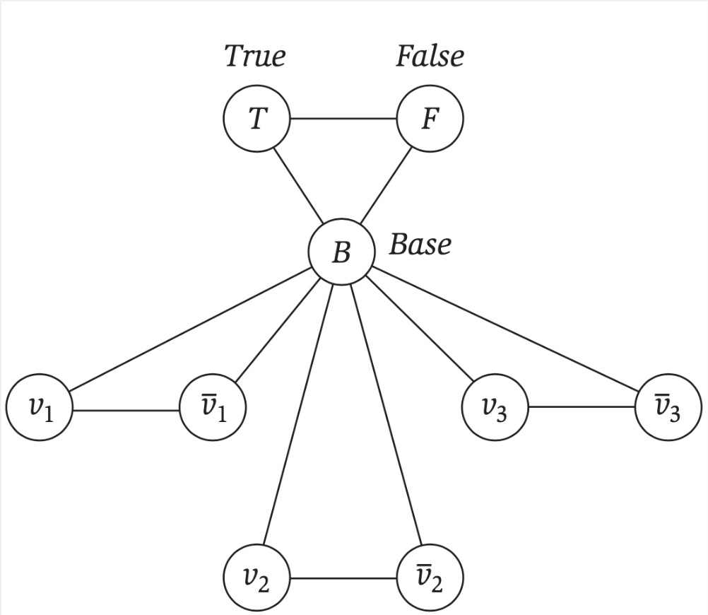
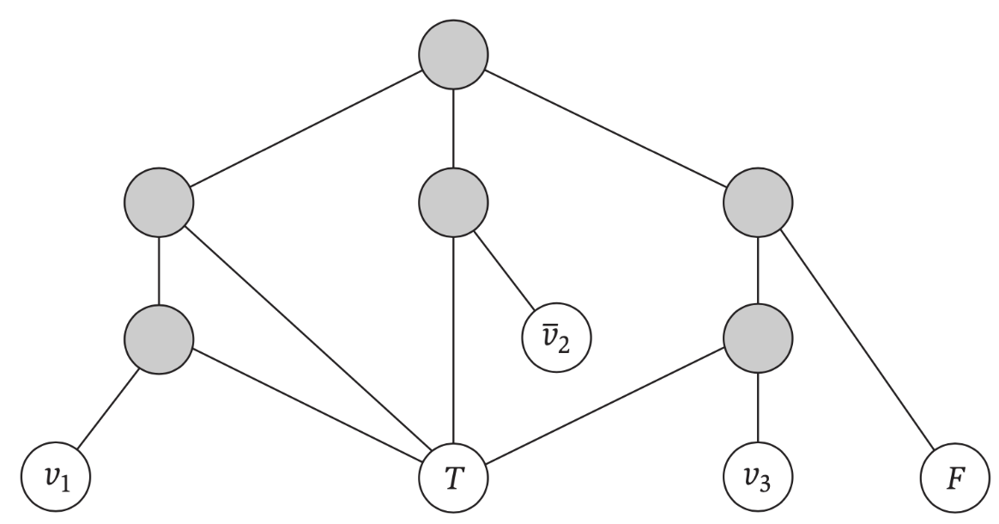

# Coloreo en Grafos

Primero vamos a demostrar que 3-Coloreo es un problema NP-Completo. Luego haremos plantearemos una reducción más para demostrar que también para todo $K > 3$, K-Coloreo es también NP-Completo. 

## Validador

```python
# asignaciones es un diccionario vertice -> color con valores del 0 al 2
def validador_3_coloreo(grafo, asignaciones):
	if len(grafo) != len(asignaciones):
		return False
	for v in grafo:
		if v not in asignaciones:
			return False

	for v in grafo:
		if asignaciones[v] < 0 or asignaciones[v] >= 3:
			return False

	for v in grafo:
		for w in grafo.adyacentes(v):
			if asignaciones[v] == asignaciones[w]:
				return False
	return True
```

Este validador termina viendo para cada vértice sus adyacentes, haciendo operaciones $\mathcal{O}(1)$ por cada uno (las operaciones sobre diccionarios son constantes), por lo que se trata de un algoritmo $\mathcal{O}(V + E)$, lineal y por lo tanto polinomial. 3-Coloreo se encuentra en NP. 

El validador para cualquier otro K (o un K genérico) sería directamente reemplazando el 3 allí por el valor correspondiente (o bien K).

## Reducción propuesta

Vamos a reducir 3-SAT a 3-Coloreo. Proponemos: 

1. Creamos por cada variable $x_i$ un nodo para sí y para su complemento. Unimos dichos vértices. 
1. Creamos 3 nodos especiales: `True`, `False` y `Base`. `Base` nos va a servir para "apropiarse" de uno de los colores. 
1. Unimos a cada variable y complemento a la `Base`. 
1. Unimos `True` y `False` con `Base`. 

Hasta aquí, tenemos un triángulo conformado por cada variable-complemento y Base, así como True-False-Base. Es decir, algo de la siguiente pinta: 

{height="200"}

Por cada cláusula tenemos que generar también conexiones para asegurar que tenga sentido. Lo que se propone es que, para una cláusula (por ejemplo) $(x_1 \lor ~x_2 \lor x_3)$ tengamos las siguientes conexiones:

{height="200"}


Es decir, que por cada cláusula se agregan 6 vértices (solamente para que "cierre") y las conexiones planteadas. 

Como vimos en clase, no vamos a ir en detalle de cómo la reducción es correcta. Podemos plantear que necesariamente `Base` tiene un color cooptado que nadie más puede tener (salvo los vértices auxiliares que agregamos) pero seguro ni variables ni complementos ni True ni False. Es decir, si o si variables y complementos deben compartir color con True y False, y necesariamente deben ser diferentes (ya que True y False están unidos, así como variables con complementos). Lo demás es analizar estos grafos propuestos. 

## Reducción para otros valores de K-Coloreo

Para demostrar, por ejemplo, que 4-Coloreo es NP-Completo, podemos reducir 3-Coloreo a este. Lo que hacemos es agregar un vértice que se conecte a **todos** los demás. Este vértice necesariamente va a tener que tener un color cooptado. Para el caso de K > 3 en general, agregamos K-3 vértices, unidos entre sí, y también a todos los demás en el grafo. 

Recomendamos que hagan ustedes la formalidad de la correctitud de esta reducción. 


