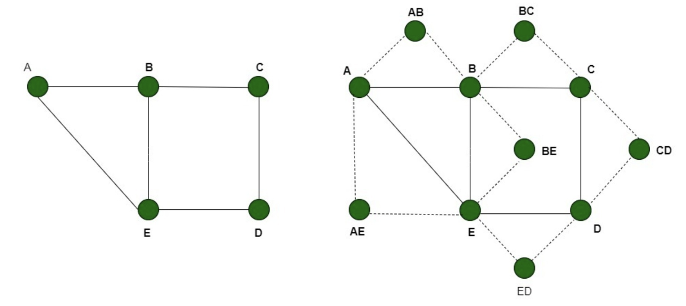

# Dominating Set

Dominating Set: Dado un grafo, el DS es un subconjunto en el que todos los vértices o bien están en el conjunto, o son adyacentes a alguno de los vértices del conjunto. 
Problema de decisión: Dado un grafo y un número $k$, ¿existe un conjunto de a lo sumo $k$ vértices que sea dominante?


## Validador

```python
# decimos que la propuesta ya es un set
def esDominatingSet(grafo, k, propuesta):
	if len(propuesta) > k:
		return False
	for v in propuesta:
		if v not in grafo:
			return False
	cubiertos = set()
	for v in propuesta:
		cubiertos.add(v)
		for w in grafo.adyacentes(v):
			cubiertos.add(w)
	return len(cubiertos) == len(grafo)
```

Por supuesto puede implementarse yendose vértice a vértice del grafo viendo que esté en el conjunto o uno de sus adyacentes. En sí es la misma idea. 
En cualquier caso, el algoritmo es lineal, y por lo tanto Dominating Set es un problema en NP. 

## Reducción propuesta (1)

En una primera instancia vamos a reducir Vertex Cover a este problema. Notar que en clase demostramos también por 3-SAT. De momento no se agrega esa reducción aquí. En caso de parecerles importante agregar dicha reducción a este documento, háganoslo saber :-)

Volviendo al caso de VertexCover, uno tiene la tendencia a pensar que se tratan del mismo problema, cuando no lo es. Notar que si a un grafo con $n$ vértices aumentamos la cantidad de aristas, el Dominating Set mínimo va a tender a ir disminuyendo en tamaño, mientras que el Vertex Cover mínimo va a ir aumentando en tamaño. 

Creamos un nuevo grafo en el cual: 
1. Tenemos los mismo vértices y aristas que en el grafo original. 
1. Por cada arista $(v, w)$ agregamos un nuevo vértice $VW$. Agregamos también dos aristas por cada uno de esos vértices, justamente una hacia $v$ y otra hacia $w$. 
1. Definimos el valor de $k$ de Dominating Set como el mismo $k$ de Vertex Cover.

Es decir, algo como lo siguiente: 

{height="200"}


**Decimos entonces que**:

Hay un Vertex Cover de a lo sumo $k$ vértices en el grafo original $\iff$ Hay un Dominating Set en el Grafo generado de a lo sumo $k' = k$ vértices. 


### Demostramos que si hay un Vertex Cover de a lo sumo $k$ vértices en el grafo original $\rightarrow$ Hay un Dominating Set en el Grafo generado de a lo sumo $k' = k$ vértices. 

Demostramos por método directo (o algo de absurdo). Si tenemos dicho vertex cover, vemos que podemos elegir esos mismos vértices como un dominating set en el grafo generado. Dado que se trata de un vertex cover en el original, todas las aristas están cubiertas. Es decir, en el grafo generado, los vértices que ya existían tienen que estar cubiertos. Los vértices ya seleccionados obviamente están cubiertos. Si hay un vértice (de los originales) que no está en el set, si o si **todos** sus adyacentes (originales) deben estar, porque sino habrá una arista (original) no cubierta. 

Restan entonces los nuevos vértices. Podemos ver que si o si estos deben estar cubiertos. Agarramos cualquiera. Este no está seleccionado, y tiene exactamente 2 adyacentes. Si ninguno de los dos adyacentes fuera parte del set, significa que en el grafo original la arista original que une a dichos dos vértices no estaría cubierta, siendo falso que eso era un vertex cover (llegando a un absurdo). 

Notamos a todo esto que al elegir los mismos vértices, estamos manteniendo la cantidad, que como en el original es a lo sumo $k$, ahora también lo será. 

De esta forma, se demuestra que si hay un Vertex cover en el original, entonces hay un Dominating set en el nuevo grafo. 


### Demostramos que si hay un Dominating Set en el Grafo generado de a lo sumo $k' = k$ vértices $\rightarrow$ Hay un Vertex Cover de a lo sumo $k$ vértices en el grafo original. 

Nuevamente supongamos que la hipótesis es verdadera. Tenemos un dominating set de a lo sumo $k$ vértices. Eso quiere decir que todos los vértices _nuevos_ están cubiertos, sea porque estos fueron elegidos, o sus adyacentes. Si alguno de estos fueron elegidos, simplemente "transferimos" la elección a cualquiera de sus dos adyacentes (y si ambos fueron seleccionados, podemos descartar la selección, y mantenemos que se usan "a lo sumo $k$"). Esto no pierde la propiedad de ser un Dominating Set, simplemente nos facilita luego plantear equivalencias. 

Ahora decimos que los vértices seleccionados (que, post modificación, son equivalentes a alguno del grafo original) son un Vertex Cover del grafo original, y son a lo sumo $k$ (podrían ser incluso menos). 

Veamos por el absurdo, suponiendo que la tesis es falsa. Para esto, deberíamos agarrar cualquier arista $(v, w)$ del grafo original y que ninguno de los vértices esté seleccionado como parte del dominating set (del grafo nuevo) como fue planteado. Si decimos que ni $v$ ni $w$ fueron seleccionados, tenemos un problema con el vértice $VW$ que agregamos en representación de dicha arista, porque como solo tiene a $v$ y $w$ como adyacentes, entonces no estaría siendo dominado/cubierto (lo cual nos llevaría a una contradicción) **salvo** que $VW$ sea parte del dominating set, pero que ya dijimos que en ese caso trasladábamos la selección a cualquiera de sus adyacentes ($v$ o $w$), llegando a otro absurdo. 

Entonces, es imposible que la arista no esté cubierta (sí o sí $v$ y/o $w$ son parte del Vertex Cover propuesto), y como eso aplica a todas las aristas del grafo, esto se trata de un Vertex Cover, demostrando que la implicación planteada es correcta. 

## Conclusión

Habiendo demostrado que a reducción propuesta es correcta (y polinomial), reduciendo un problema NP-Completo (Vertex Cover), y demostrando que Dominating Set está en NP, podemos concluir que Dominating Set es un problema NP-Completo. 
