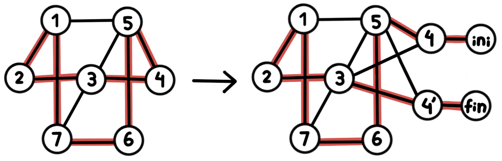

# Camino Hamiltoniano no dirigido

Planteada una vez la reducción que demuestra que Camino Hamiltoniano para grafos dirigidos es un problema NP-Completo, podemos también demostrar que la versión para grafos no dirigidos del problema también lo es.

## Validador

```python
def es_camino_hamiltoniano(grafo, camino):
	if len(camino) != len(grafo):
		return False
	if len(grafo) == 0:
		return True
	visitados = set() # para evitar repeticiones

	anterior = camino[0]
	if anterior not in grafo:
		return False
	visitados.add(anterior)

	for actual in camino[1:]:
		if actual not in grafo or not grafo.hay_arista(anterior, actual):
			return False
		if actual in visitados: # ya fue visitado
			return False
		visitados.add(actual)
		anterior = actual

	return True
```
El validador funciona para el problema en su versión de grafos dirigidos y no dirigidos, ya que simplemente sigue el camino propuesto. Al ser el mismo validador, la complejidad es nuevamente de orden $\mathcal{O}(V)$ (se recorren todos los vértices del grafo en el peor de los casos). Entonces, como es verificable con un validador en tiempo polinomial, el Problema de Camino Hamiltoniano para grafos no dirigidos está en NP. 

## Reducción propuesta

Vamos a reducir el problema de Ciclo Hamiltoniano, ya conocido como NP-Completo, al problema de Camino Hamiltoniano. En ambos casos estamos hablando de la versión del problema para grafos no dirigidos. 

La reducción propuesta para el caso de los grafos dirigidos ya no funciona, ya que distinguía entre entradas y salidas para un vértice en particular. 

La reducción en este caso resulta de seleccionar cualquiera de los vértices del grafo original para transformarlo en un inicio y fin de un camino hamiltoniano en un nuevo grafo. Con este propósito, el vértice (junto a todas sus aristas) es duplicado. Además se añade para el vértice seleccionado y su duplicado un vértice extra conectado a cada uno de ellos correspondientemente para forzar el inicio y el fin de un potencial camino.

Por ejemplo: 



Nota: utilizo "ini" y "fin" para aclarar que dichos vértices fueron introducidos con el fin de forzar el comienzo y el fin del camino. De todos modos, al ser un grafo no dirigido ambos podrían ser el inicio o el fin.

**Decimos entonces que**:

Existe Ciclo Hamiltoniano en el grafo original $\iff$ existe Camino Hamiltoniano en el grafo nuevo. 


### Demostramos que si existe Ciclo Hamiltoniano en el grafo original $\rightarrow$ existe Camino Hamiltoniano en el grafo nuevo

Supongamos que en el grafo original hay un ciclo Hamiltoniano, es decir un ciclo que pasa por todos los vértices una vez. Sea $v$ el vértice que seleccionamos para duplicar en la reducción. En el nuevo grafo tendremos dos copias de este vértice, $v'$ y $v''$, cada una conectada a los mismos vértices que $v$ en el grafo original. Además agregamos dos nuevos vértices $a$ y $b$, conectados respectivamente a $v'$ y $v''$, para forzar el inicio y el final del camino.

En el Ciclo Hamiltoniano original podemos comenzar a recorrer el ciclo desde el vértice $v$. Si eliminamos la última arista que vuelve a $v$, obtenemos un camino que pasa por todos los demás vértices exactamente una vez. Entonces, podemos obtener un camino comenzando por $a$, recorriendo el ciclo entero comenzando por $v'$ excepto por la última arista de cierre, continuando por $v''$ (que necesariamente existe, porque si cerraba ciclo, es porque existía la arista a $v$, entonces ahora existe a $v''$) y cerrando en $b$. Es decir:

$$
a \rightarrow v' \rightarrow ... \rightarrow v'' \rightarrow b
$$

donde el tramo intermedio corresponde exactamente al recorrido del ciclo original (sin cerrarlo). Como $v'$ y $v''$ tienen las mismas conexiones que tenía $v$, todas las aristas necesarias existen en el nuevo grafo.

Este camino visita todos los vértices exactamente una vez, por lo que se trata de un **camino Hamiltoniano** en el grafo nuevo.


### Demostramos que si existe Camino Hamiltoniano en el grafo nuevo $\rightarrow$ existe Ciclo Hamiltoniano en el grafo original

Los vértices $a$ y $b$ tienen grado 1, ya que cada uno está conectado únicamente a $v'$ y $v''$ respectivamente. Por lo tanto, cualquier camino Hamiltoniano necesariamente debe empezar y terminar en $a$ y $b$ (al ser no dirigido es intercambiable cuál "inicia" y cuál "termina")

Por lo tanto, el camino Hamiltoniano es de la forma:

$$
a \rightarrow v' \rightarrow ... \rightarrow v'' \rightarrow b
$$

Si eliminamos los vértices $a$ y $b$ de este camino, obtenemos un camino que pasa por todos los vértices restantes exactamente una vez, comenzando en $v'$ y terminando en $v''$.

Si volvemos al grafo original y reemplazamos $v'$ y $v''$ por el vértice original $v$, obtenemos un ciclo que pasa por todos los vértices exactamente una vez y vuelve al punto inicial. Es decir, obtenemos un **ciclo Hamiltoniano en el grafo original**.

## Conclusión

Habiendo demostrado tanto que la reducción propuesta del problema NP-Completo del Ciclo Hamiltoniano en grafos no dirigidos es correcta y polinomial,como que Camino Hamiltoniano está en NP, podemos concluir que Camino Hamiltoniano para grafos no dirigidos es un problema NP-Completo. 
